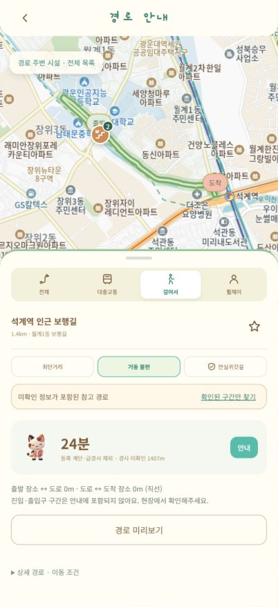
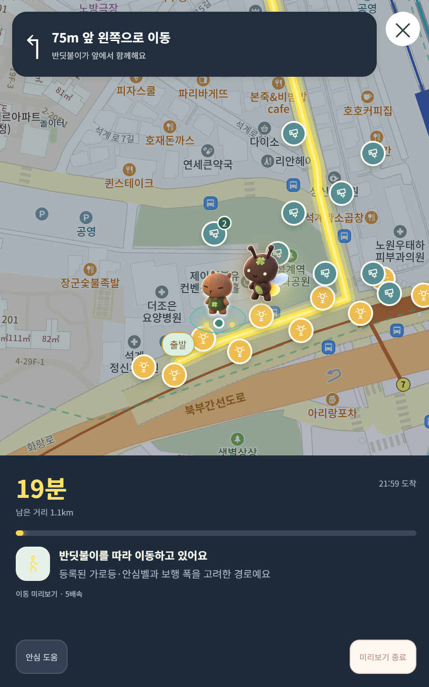
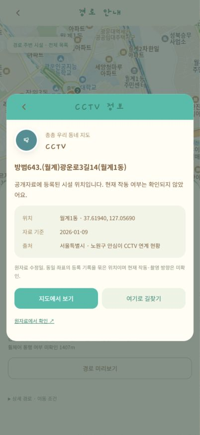

# 총총월계길

**월계1동의 보행 조건과 생활정보를 함께 확인하는 주민 참여형 지도**

2026 광운대학교 KW해커톤 · **팀 ESGenius** · 배리어프리·생활편의

총총월계길은 공사 정보, 계단, 가로등과 주민 제보를 한 지도에 모아, 이용자가 자신의 이동 조건에 맞는 길을 선택하도록 돕는 모바일 웹앱입니다. 낮에는 고양이, 밤에는 반딧불이 캐릭터가 경로를 따라 함께 이동합니다.

## 왜 총총월계길인가요

같은 목적지로 가더라도 계단을 피해야 하는 사람, 공사 구간을 돌아가려는 사람, 밤에 주변 시설을 확인하며 걷고 싶은 사람에게 필요한 정보는 다릅니다. 월계1동의 변화하는 보행환경을 살피고, 거리와 이동 조건을 함께 비교할 수 있는 서비스를 만들었습니다.

- **이동 조건에 맞는 선택:** 최단거리와 계단 회피 경로를 비교하고, 휠체어·유모차 조건을 적용합니다.
- **지역정보를 한곳에서 확인:** 공사, 가로등·보안등, CCTV, 비상벨과 보행시설의 위치·출처를 확인합니다.
- **주민이 함께 보완하는 지도:** 사진과 위치를 포함한 제보, 공감, 운영자 검토로 동네 정보를 보완합니다.

## 핵심 화면

| 계단을 피하는 경로 | 반딧불이 동행 | 시설 위치와 자료 출처 |
| :---: | :---: | :---: |
|  |  |  |

2026-10-08 개발 화면입니다. 동행 화면은 이동 미리보기이며, 시설 위치와 경로의 현장 통행 상태는 구분해 표시합니다.

## 핵심 기능

| 기능 | 구현 내용 | 시연에서 확인할 점 |
| --- | --- | --- |
| 조건별 길찾기 | 최단거리·거동 불편·안심귀갓길 비교, 휠체어·유모차 조건, 경유지 최대 3개 | 같은 출발·도착에서 조건을 바꾸면 경로와 확인 정보가 갱신됩니다. |
| 공사 우회 | 운영자가 등록한 통제와 공개 공사 주소 주변 회피, 추가 거리 표시 | 공사를 고려한 경로와 우회 거리를 확인할 수 있습니다. |
| 낮·밤 동행 | 일출·일몰 자동 전환, GPS 위치·남은 거리·회전 방향, 캐릭터 안내 | GPS 없이도 경로 미리보기로 이동 흐름을 볼 수 있습니다. |
| 우리 동네 시설 | 가로등·보안등·CCTV·비상벨·계단·언덕·엘리베이터·공사 레이어 | 개별 시설의 자료 기준일, 출처와 확인 상태를 볼 수 있습니다. |
| 주민 참여 | 회원가입·로그인, 위치·사진을 포함한 제보, 공감·취소, 부적절한 제보 신고 | 작성부터 목록·상세·공감까지 연결됩니다. 사진은 최대 2장입니다. |
| 나의 장소와 길 | 최근 검색, 기기 내 장소 저장, 로그인 후 경로 저장·다시 찾기 | 저장한 길은 이용할 때 최신 데이터로 다시 계산합니다. |
| 모바일 웹앱 | 반응형 화면, PWA manifest·아이콘·오프라인 안내 | HTTPS 배포 후 Android Chrome에서 홈 화면에 추가할 수 있습니다. |

**구현 범위:** 경로 계산과 회원·제보·저장 API를 실제로 연결한 웹앱입니다. 공개자료에서 확인하지 못한 경사·통행 가능 여부·점등 상태는 미확인으로 표시합니다. 현장 확인 자료가 없는 휠체어 경로는 ‘확인된 길만’ 조건에서 제공하지 않으며, 이용자가 선택하면 미확인 구간을 포함한 참고 경로를 보여줍니다.

## 앱에서 확인하기

[로컬 실행](#로컬-실행) 후 **길찾기 → 시연 추천 경로 보기**에서 선택합니다. 아래 링크는 서버를 실행한 PC에서 열 수 있습니다.

| 추천 시연 | 확인 순서 | 2026-10-08 스냅샷 기준 결과 |
| --- | --- | --- |
| [계단 회피 비교](http://127.0.0.1:5173/?showcase=comfort) | ‘최단거리’와 ‘거동 불편’을 번갈아 선택 | 장월교 인근 → 석계역 인근. 849m·계단 1구간에서 1,407m·계단 0구간으로 변경 |
| [안심귀갓길](http://127.0.0.1:5173/?showcase=night) | 시설 정보 확인 → 경로 미리보기 | 석계역 인근 → 광운대역 인근. 1,159m, 경로 25m 내 가로등 9곳·CCTV 18곳 표시 |
| [휠체어 참고 경로](http://127.0.0.1:5173/?showcase=wheelchair) | 참고 경로 → ‘확인된 길만’ 비교 | 계단을 제외한 1,407m 참고 경로와 현장 통행 미확인 상태를 구분 |
| [공사 우회](http://127.0.0.1:5173/?showcase=construction) | ‘경로 자세히’에서 공사·추가 거리 확인 | 월계동 298 인근. 비교 경로 86m → 우회 경로 159m, 73m 추가 |

거리·시설 수는 자료 갱신과 공사 기간에 따라 달라질 수 있습니다. 공사 주소 기반 회피는 수집 후 48시간 이내 자료에 적용되므로, 오래된 스냅샷에서는 결과가 달라집니다. [공사 자료 갱신 방법](backend/data/CONSTRUCTION-SOURCES.md)을 참고하세요.

주민 참여 기능은 **내 정보 → 로그인·회원가입 → 제보** 순서로 확인합니다. 현재 로컬 개발 구성에서는 주민 계정을 직접 만들 수 있습니다. 지도에서 위치를 선택하면 GPS 권한 없이도 제보 흐름을 확인할 수 있습니다.

## 기술 스택과 선택 이유

| 영역 | 사용 기술 | 선택 이유 |
| --- | --- | --- |
| 화면 | TypeScript, Vite, HTML/CSS | API 데이터 형식을 명확하게 관리하고 모바일 화면을 빠르게 개발·빌드합니다. |
| 서버 | Node.js 24, Fastify, TypeBox | 프론트와 TypeScript를 공유하고 API 입력 스키마·권한 검증을 구성합니다. |
| 저장소 | SQLite | 별도 DB 서버 없이 계정·제보·공사 통제·저장 경로를 영속적으로 관리합니다. |
| 지도·검색 | Kakao Maps JavaScript SDK, Kakao Local REST API | 지도 표시와 장소 검색을 연결합니다. 보행 경로는 자체 계산합니다. |
| 경로 계산 | OpenStreetMap 보행망, 자체 조건별 그래프 탐색 | 계단·접근성·조명·공사 조건을 경로 탐색에 직접 반영합니다. |
| 낮·밤 전환 | SunCalc | 월계1동 좌표의 일출·일몰 시각에 맞춰 안내 모드를 전환합니다. |
| 인증 | 로컬 scrypt·세션 해시, 운영용 Supabase Auth·JWT 연동 | 개발 시 회원 흐름을 재현하고 운영 시 외부 인증 공급자의 서명을 검증합니다. |
| 디자인·앱 이용 | Figma, PWA, Capacitor 연동 코드 | 일관된 모바일 UI와 홈 화면 앱 이용을 지원합니다. 현재 기본 제공 방식은 웹/PWA입니다. |
| 배포·검증 | Docker Compose, Caddy, GitHub Actions, Node.js 테스트 | HTTPS 배포 구성과 자동 테스트·빌드 실행 흐름을 저장소에 포함했습니다. |

Vite 프론트가 Fastify API에 경로 계산·제보·저장을 요청하고, 서버는 공개자료 스냅샷과 SQLite의 주민·운영 정보를 함께 사용합니다. Kakao REST 키는 서버에서만 사용합니다.

## 사용 데이터와 경로 해석

현재 스냅샷은 월계1동 공개 보행망 **연결점 1,783개·구간 1,886개**를 사용합니다.

| 데이터 | 반영 범위 | 해석 기준 |
| --- | --- | --- |
| 보행망·행정경계 | OpenStreetMap, 서울시 공개 경계 | 공개 지도 기반이며 출입구·보도·현장 접근성 전수조사 결과는 아닙니다. |
| 가로등 | 시 관리 가로등 16개, 스마트폴 가로등 1개 | 등록 위치이며 현재 밝기·점등 여부는 미확인입니다. |
| 과거 보안등 | 2018년 기록의 주소 기준점 290개 | 점선 마커로 구분하고 야간 경로 가중치에서 제외합니다. |
| CCTV | 같은 좌표를 묶은 190곳 | 카메라 대수가 아닙니다. 주변 위치를 표시하며 경로에 안전 점수를 더하지 않습니다. |
| 비상벨 | 화장실 비상벨의 건물 기준점 6곳 | 실내·운영시간 제한이 있어 실외 야간 경로 가중치에서 제외합니다. |
| 공사 | 서울시 도로굴착 자료, 건설알림이 | 주소 기준점과 사업 대표 위치를 구분합니다. 사업 대표 위치는 자동 통제로 처리하지 않습니다. |

공사 주소 기반 우회는 **주소 반경 25m의 보행 구간을 예방적으로 피하는 정책**입니다. 실제 공사 통제선을 측정한 결과는 아닙니다. 주민 제보는 지도에서 확인할 수 있지만, 미검토 제보를 바로 통행금지로 반영하지 않습니다.

자료가 같은 조건에서는 최단거리와 야간 경로가 같을 수 있습니다. 등록된 시설의 수는 실제 밝기나 안전성 측정값이 아닙니다.

출처·수집일·처리 방법: [월계1동 데이터 문서](backend/docs/wolgye1-data.md) · [공사 자료 문서](backend/data/CONSTRUCTION-SOURCES.md)

## 로컬 실행

**준비물:** Node.js **24.x**, npm, Kakao JavaScript 키. 장소 검색을 모두 이용하려면 Kakao REST API 키도 필요합니다.

### 1. 저장소 받기

```sh
git clone https://github.com/2026-KW-HACKATHON/08_ESGenius.git
cd 08_ESGenius
```

이미 프로젝트 폴더를 받은 경우 해당 폴더에서 시작합니다.

### 2. 백엔드 실행 — 터미널 A

```sh
cd backend
npm ci
npm run setup
npm run mobile
```

`setup`은 기존 설정을 보존하고, 설정이 없으면 `.env`와 무작위 개발용 토큰을 만듭니다. `mobile`은 `127.0.0.1:4101`에서 API를 실행하고 빈 로컬 DB에 공개자료를 반입합니다.

장소 검색용 REST 키는 `backend/.env`의 `KAKAO_REST_API_KEY`에 설정한 뒤 서버를 재시작합니다. 키가 없으면 검색 범위가 보행망에 등록된 지점 이름으로 제한됩니다.

### 3. 프론트엔드 실행 — 터미널 B

프로젝트 루트에서 실행합니다.

```sh
cd mobile
npm ci
node -e "const fs=require('node:fs');if(!fs.existsSync('.env.local'))fs.copyFileSync('.env.example','.env.local')"
```

`mobile/.env.local`의 `VITE_KAKAO_JAVASCRIPT_KEY`에 **JavaScript 키**를 입력합니다. `VITE_API_URL`은 비워두고, Kakao 개발자 설정에 `http://127.0.0.1:5173`을 등록합니다.

```sh
npm run dev
```

브라우저에서 **[http://127.0.0.1:5173](http://127.0.0.1:5173)**을 엽니다. Vite가 `/api` 요청을 로컬 백엔드로 전달합니다. 배경 지도가 나타나지 않으면 JavaScript 키와 등록 도메인을 확인하세요.

API 문서: [Swagger UI](http://127.0.0.1:4101/docs) · [서버 상태](http://127.0.0.1:4101/health)

세부 설정: [프론트엔드 실행 안내](mobile/README.md) · [백엔드 API 안내](backend/README.md)

`.env`, SQLite DB, 개발 토큰, 서명 키와 `node_modules`는 Git에 포함하지 않습니다.

## 검증 결과와 운영 범위

2026-10-08 로컬 검토에서 **백엔드 59개·프론트엔드 24개, 총 83개 테스트와 양쪽 빌드가 통과**했습니다.

- **경로:** 계단·급경사 제외, 접근성 미확인 처리, 일방통행, 경유지, 공사 회피와 재탐색을 검증했습니다.
- **회원·제보:** 계정별 권한, 위조·만료 세션, 로그아웃, 중복 제출, 사진 입력 검증과 숨김 제보 처리를 검증했습니다.
- **화면:** 지도, 계단 회피·휠체어 참고 경로, 야간 시설 표시, 이동 미리보기와 제보 목록을 브라우저에서 확인했습니다.

각 폴더에서 다음 명령으로 다시 확인할 수 있습니다.

```sh
# backend/와 mobile/에서 각각 실행
npm test
npm run build
```

[CI 설정](.github/workflows/ci.yml)은 두 프로젝트의 의존성 설치, 테스트와 빌드를 실행하도록 구성되어 있습니다. 위 통과 기록은 로컬 검증 결과입니다.

현재 확인 범위는 **로컬 웹 실행**입니다. 외부 접속용 HTTPS 서비스 주소, 운영용 Supabase 로그인, 실제 휴대폰 이동 중 GPS는 별도 검증이 필요합니다. 음성·백그라운드 내비게이션과 OS 푸시는 제공하지 않습니다. 오프라인에서는 경로 안내를 중단하고 연결 안내를 표시합니다.

<details>
<summary>운영 배포 구성과 남은 확인 사항</summary>

[Docker Compose + Caddy 배포 안내](deploy/README.md)를 제공합니다. 운영 서버는 Supabase 등 JWT 인증 공급자 설정이 필요하며, 로컬 개발 계정은 운영 환경에 그대로 사용하지 않습니다. HTTPS 배포 후 Android Chrome에서 홈 화면에 추가할 수 있습니다. PC의 `127.0.0.1` 주소는 다른 휴대폰에서 접속할 수 없습니다.

제출 전 검토에서 확인한 배포 보완 항목은 다음과 같습니다.

- Docker 이미지에 공사 사업·지형 스냅샷(`wolgye-construction-projects.json`, `wolgye-terrain.json`)을 포함해야 합니다.
- Caddy 뒤에서 사용자별 API 요청 제한이 동작하도록 신뢰할 프록시 범위를 설정해야 합니다.
- Docker 빌드·TLS 발급, 실기기 GPS 권한·화면 잠금·네트워크 복귀를 검증해야 합니다.

</details>

## 프로젝트 구성

```text
.
├── mobile/         # TypeScript + Vite 화면, PWA, Capacitor 연동
│   ├── src/        # 지도·경로·주민 제보·설정
│   ├── public/     # Figma 에셋, 폰트, 아이콘, 서비스워커
│   └── test/       # 프론트 기능 테스트
├── backend/        # Fastify API, SQLite, 경로 계산
│   ├── src/        # 인증·경로·공사·시설·저장소
│   ├── data/       # 공개자료 스냅샷과 출처
│   ├── scripts/    # 개발 실행·자료 수집·반입
│   └── test/       # API·경로·권한 테스트
├── deploy/         # Docker Compose·Caddy 배포 구성
├── docs/images/    # README 화면 이미지
└── .github/        # 테스트·빌드 워크플로
```

## 팀 소개

**ESGenius**

| 팀원 | 담당 |
| --- | --- |
| 김시호 | 기획, 디자인 |
| 박규리 | 프론트엔드, 백엔드 |
| 허채영 | 디자인, 프론트엔드 |
| 김지우 | 기획, 발표 |

저장소: [2026-KW-HACKATHON/08_ESGenius](https://github.com/2026-KW-HACKATHON/08_ESGenius)

## 출처와 이용 안내

- 지도 표시·장소 검색: Kakao Maps JavaScript SDK, Kakao Local REST API.
- 보행망: [© OpenStreetMap contributors](https://www.openstreetmap.org/copyright). 원자료의 ODbL 이용조건과 출처 표시를 따릅니다.
- 행정경계·시설·공사: 서울시 열린데이터광장 등 공개자료. 원본 링크와 자료별 이용조건은 [데이터 문서](backend/docs/wolgye1-data.md)에 기록했습니다.
- 과거 보안등 원자료 보존본: [MJU FENCE 데이터 저장소](https://github.com/MJU-Capstone-Design/FENCE_data_analysis). 고정 커밋과 처리 내역은 스냅샷에 기록했습니다.
- 화면·캐릭터 에셋: 프로젝트 Figma 디자인. 폰트: [Gaegu OFL](mobile/public/fonts/Gaegu-OFL.txt), [Noto Sans KR OFL](mobile/public/fonts/NotoSansKR-OFL.txt).

향후 현장조사로 경사·보도 폭·휠체어 통행 정보를 보완하고, 공공자료 갱신과 주민 제보 검토를 연결해 실제 이용 가능한 구간을 넓혀갈 계획입니다.
